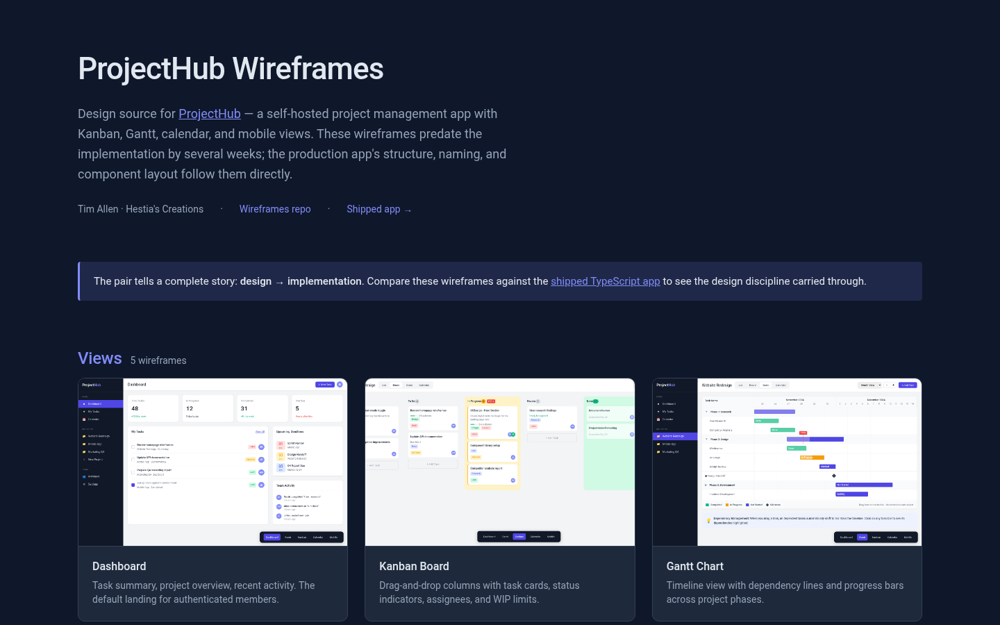

# ProjectHub Wireframes

Design source for [ProjectHub](https://github.com/Helo3301/projecthub) — a self-hosted project management app with Kanban, Gantt, calendar, and mobile views.

These five HTML files and one stylesheet are the wireframes that the shipped product was built against. They predate the implementation by several weeks; the production app's structure, naming, and component layout follow these directly.

## Browse the gallery

Open [`index.html`](index.html) for the polished gallery view. Once GitHub Pages is enabled the live URL is `https://helo3301.github.io/projecthub-wireframes/`.

## What's here

| File | View |
|---|---|
| `dashboard.html` | Dashboard — task summary, project overview, recent activity |
| `kanban.html` | Kanban board with drag-and-drop columns |
| `gantt.html` | Gantt chart with dependency lines and progress bars |
| `calendar.html` | Monthly calendar with task overlays |
| `mobile.html` | Mobile-first task list and navigation |
| `styles.css` | Shared design tokens, typography, color palette |
| `index.html` | Polished portfolio gallery (the entry point above) |
| `gallery.css` | Gallery-only styling |

Each wireframe file is self-contained and browser-openable. No build step.

## Why this is in the portfolio

The pair tells a complete story: design → implementation. Recruiters and clients can compare these wireframes against the [shipped TypeScript app](https://github.com/Helo3301/projecthub) and see the design discipline carried through.

## License

See [LICENSE](LICENSE) if present, otherwise: design work © Tim Allen, all rights reserved.
